## Project: Innovative Speech Interaction System of Lifting Devices and their Human Operators

Intelligent interactive control system of mobile loader cranes.

Interaction system using neural networks, fuzzy logic, complex data processing and spoken NLP command control. 

Innovative interaction system for processing complex data using neural networks, fuzzy logic, simulation models and data calculation models.

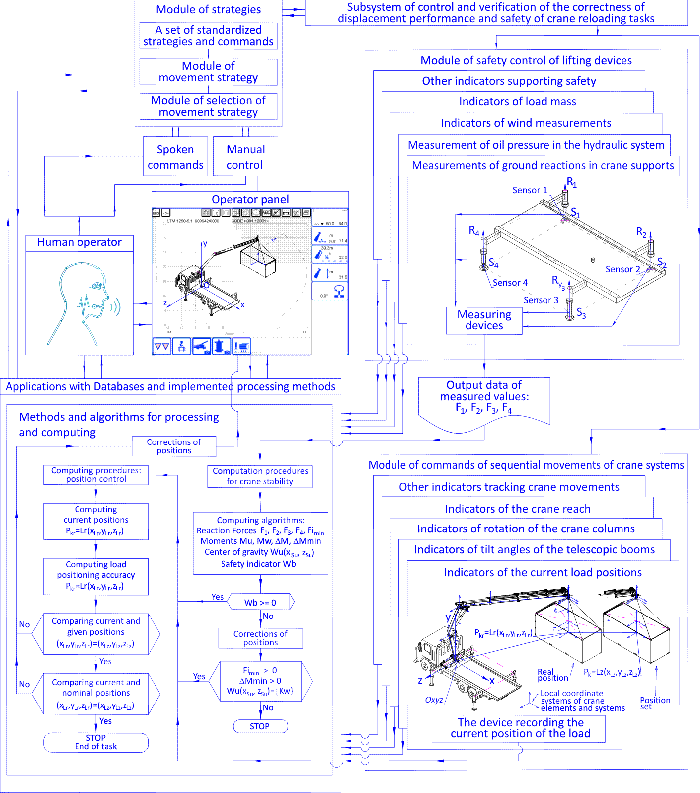

Functional diagrams of the interactive control system of the mobile crane - the structure and dependencies of the complex data.

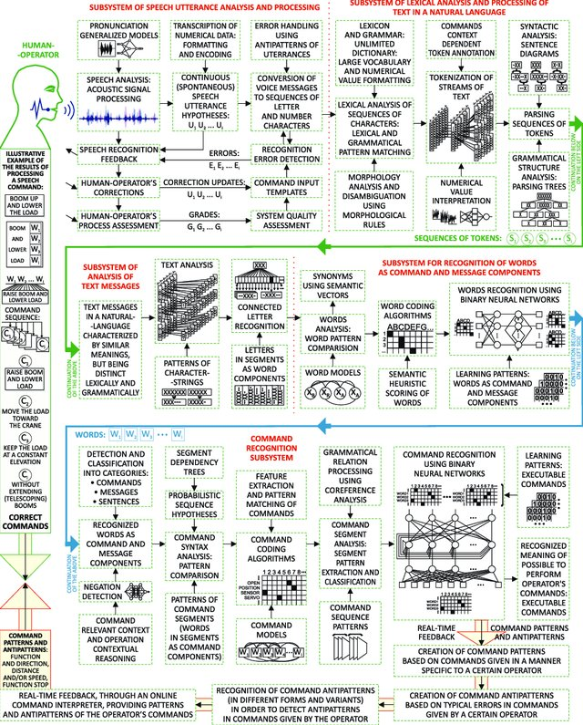

Recognition of speech commands in natural language.

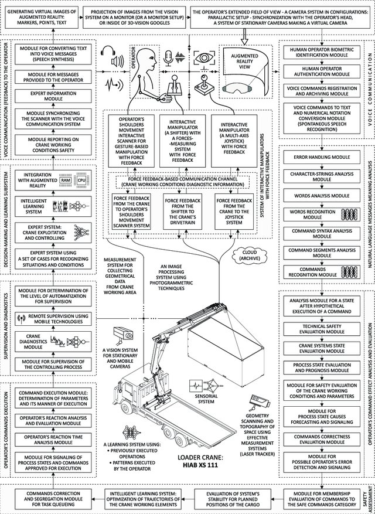

Architecture of the system for speech interaction between the loader crane and the operator.

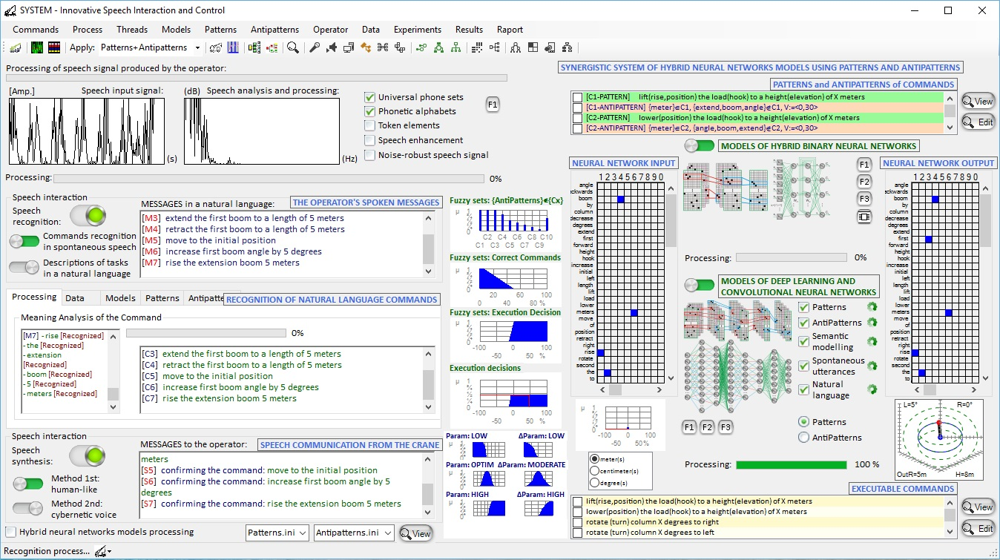

Interaction system using neural networks, fuzzy logic, complex data processing, spoken NLP command control, and machine learning antipatterns. 

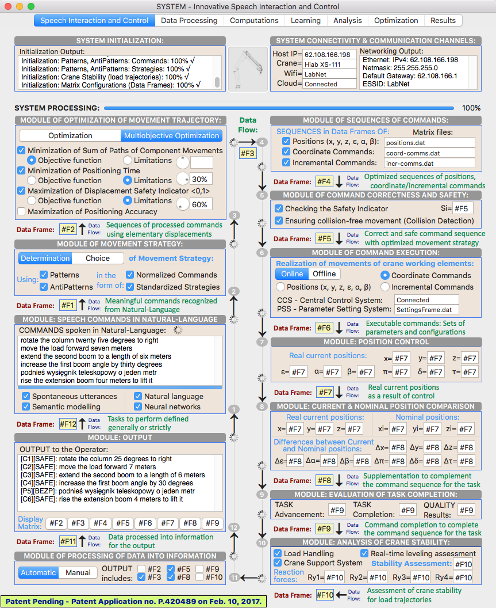

Interaction system with complex data processing and spoken NLP command control (for macOS).

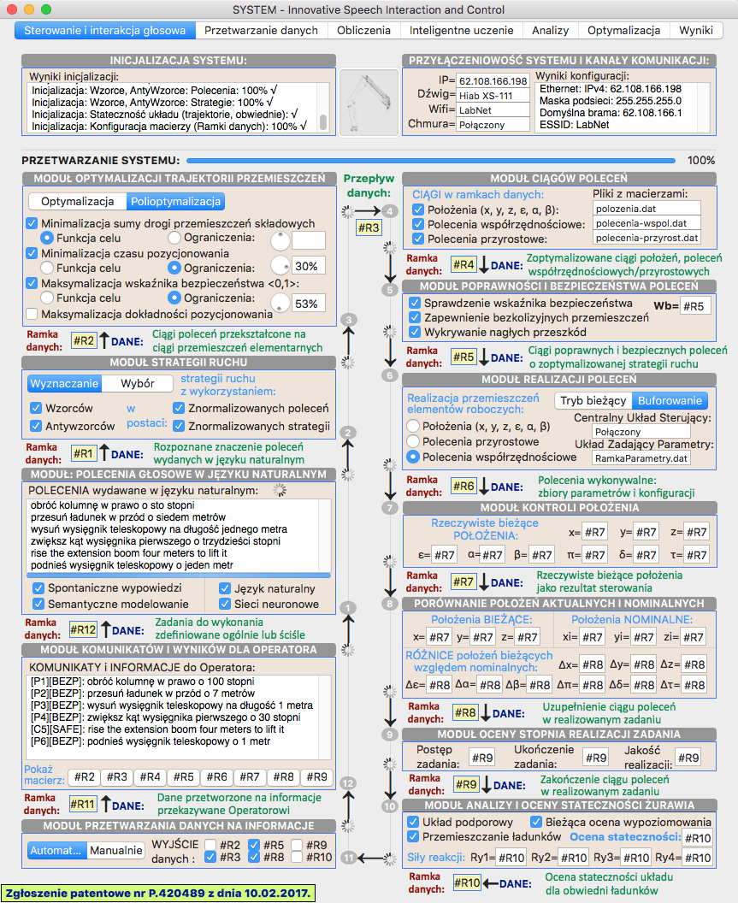

Interaction system with complex data processing and spoken NLP command control (for macOS).

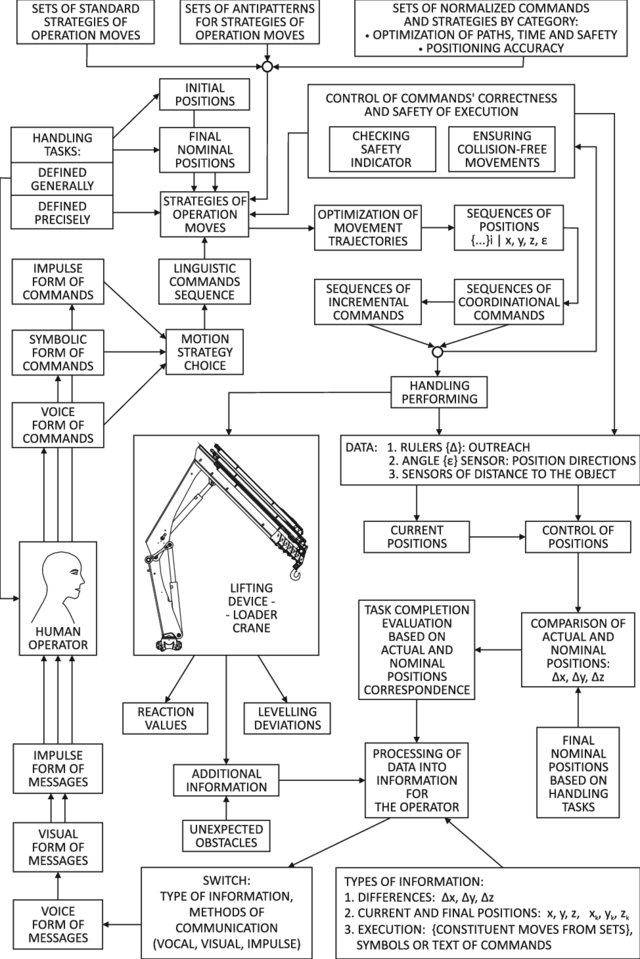

Modules of the interaction system for crane control. 

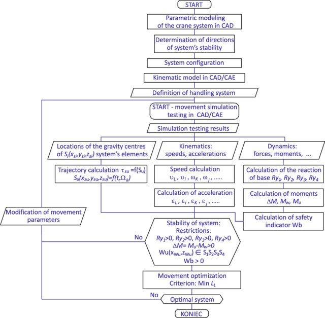

Computer aided analysis and simulation of the mobile crane handling system.

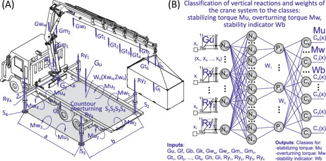

Computational intelligence methods for analysis of the crane handling system and processes.

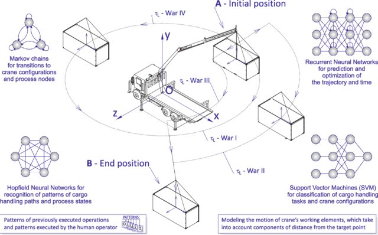

Computational intelligence methods for analysis of the crane handling system and processes.

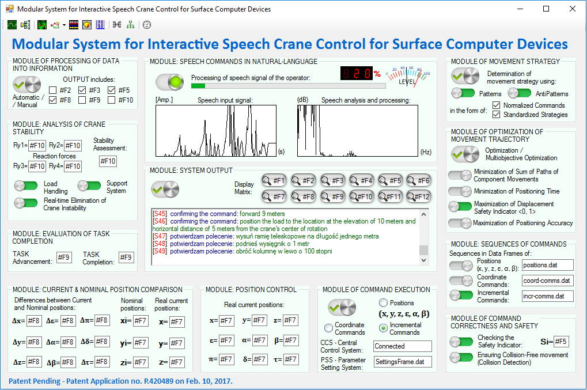

Modular system for interactive speech crane control for surface computer devices. 

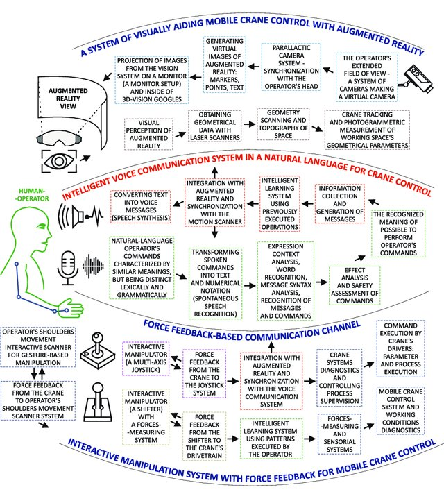

ARSC systems for loader cranes.

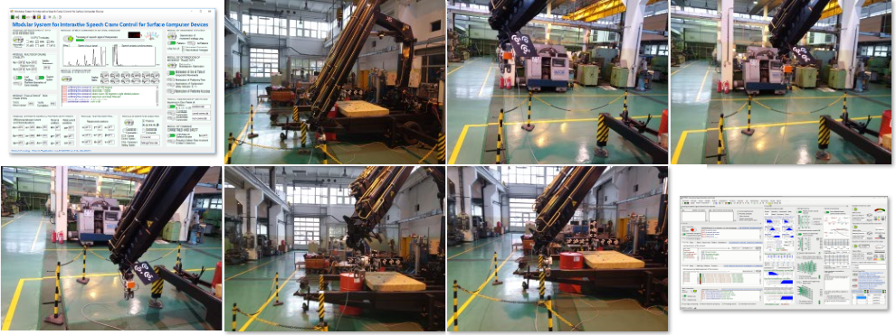

Interactive crane control research.

## Source:

Majewski M., Kacalak W.: 
[Conceptual Design of Innovative Speech Interfaces with Augmented Reality and Interactive Systems for Controlling Loader Cranes](http://doi.org/10.1007/978-3-319-33625-1_22)  

Majewski M., Kacalak W.: 
[Intelligent Speech Interaction of Devices and Human Operators](http://doi.org/10.1007/978-3-319-33622-0_42)

Majewski M., Kacalak W.: 
[Human-Machine Speech-Based Interfaces with Augmented Reality and Interactive Systems for Controlling Mobile Cranes](http://doi.org/10.1007/978-3-319-43955-6_12)

Majewski M., Kacalak W.: 
[Intelligent Speech-Based Interactive Communication Between Mobile Cranes and Their Human Operators](http://doi.org/10.1007/978-3-319-44781-0_62)

Majewski M., Kacalak W.: 
[Building Innovative Speech Interfaces using Patterns and Antipatterns of Commands for Controlling Loader Cranes](http://dx.doi.org/10.1109/CSCI.2016.0105)

Majewski M., Kacalak W.: 
[Innovative Intelligent Interaction Systems of Loader Cranes and Their Human Operators](http://doi.org/10.1007/978-3-319-57261-1_47)

Majewski M., Kacalak W.: 
[Smart Control of Lifting Devices Using Patterns and Antipatterns](http://doi.org/10.1007/978-3-319-57261-1_48)

## Goal: 

Main goal of the project is to design and build a prototype of an innovative intelligent speech interaction system between loader cranes (Hiab XS 111) and their human operators. The presented research consists of implementing complex applications (interaction system) for crane control using hybrid neural networks for processing spoken natural languages and data. It also covers the development of mathematical and simulation models, and methods for computing crane operations and strategies in order to analyze many invented solutions to important problems. The research also includes the integration of the implemented speech-based interface with vision and sensorial systems, as it is a part of the main project in which the loader crane controlled by the developed ARSC (Augmented Reality & Smart Control) system will be used for experimental investigations of the system efficiency and increased operator's safety.

The main project is financed by the National Centre for Research and Development, Poland (NCBiR), under the Applied Research Programme.

## Methods: 
C#, SolidWorks, Objective-C, AutoCAD, Visual Studio, Xcode, Mac OS X, iOS, Windows Operating Systems, Neural Networks, Matlab, Optimization.

