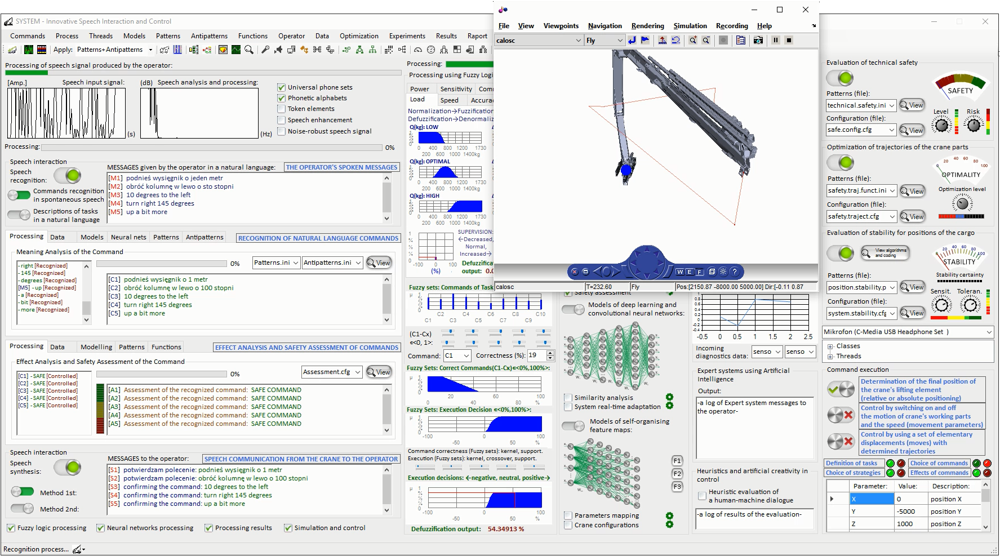

# interaction-system-crane
interaction-system-crane
Project: Interactive Control Systems for Mobile Loader Cranes

Majewski M., Kacalak W.: 
[Conceptual Design of Innovative Speech Interfaces with Augmented Reality and Interactive Systems for Controlling Loader Cranes].(http://doi.org/10.1007/978-3-319-33625-1_22)  

Majewski M., Kacalak W.: Intelligent Speech Interaction of Devices and Human Operators.
http://doi.org/10.1007/978-3-319-33622-0_42

Majewski M., Kacalak W.: Human-Machine Speech-Based Interfaces with Augmented Reality and Interactive Systems for Controlling Mobile Cranes.
http://doi.org/10.1007/978-3-319-43955-6_12

Majewski M., Kacalak W.: Intelligent Speech-Based Interactive Communication Between Mobile Cranes and Their Human Operators.
http://doi.org/10.1007/978-3-319-44781-0_62

Majewski M., Kacalak W.: Building Innovative Speech Interfaces using Patterns and Antipatterns of Commands for Controlling Loader Cranes.
http://dx.doi.org/10.1109/CSCI.2016.0105

Majewski M., Kacalak W.: Innovative Intelligent Interaction Systems of Loader Cranes and Their Human Operators.
http://doi.org/10.1007/978-3-319-57261-1_47

Majewski M., Kacalak W.: Smart Control of Lifting Devices Using Patterns and Antipatterns.
http://doi.org/10.1007/978-3-319-57261-1_48
